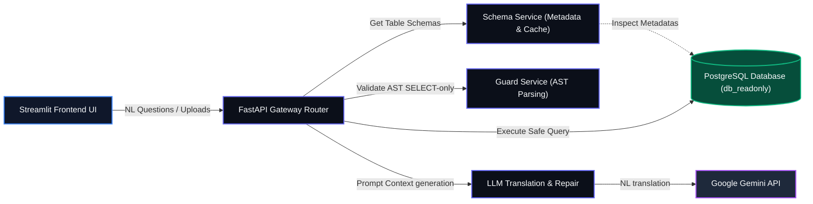

# DataPilot System Architecture & Design

This document details the software architecture, sequential request patterns, and system design patterns implemented in DataPilot.

---

## 🏛️ System Architecture Diagram

DataPilot follows a decoupled client-server architecture. The Streamlit client interacts solely with the FastAPI REST API backend, which orchestrates communication with the database and Google Gemini API services.

---

## 🔄 Request Flow Diagram

The sequence diagram below displays the lifecycle of a user query—from the browser interface down to database access enforcement and AI self-repair steps:

```mermaid
sequenceDiagram
    autonumber
    actor User as User Interface (Streamlit)
    participant API as FastAPI Gateway
    participant Cache as Schema Cache
    participant LLM as Google Gemini API
    participant Guard as AST SQL Validator (SQLGlot)
    participant DB as PostgreSQL Database

    User->>API: POST /api/v1/query (NL Question)
    Note over API: Rate Limit Validation checks passed
    API->>Cache: Request schema metadata
    Cache-->>API: Active schemas context
    API->>LLM: Translate Question to SQL (Schema appended)
    LLM-->>API: Raw SQL string
    API->>Guard: Validate and sanitize SQL
    Note over Guard: AST validation checks for SELECT-only, injects row caps
    Guard-->>API: Sanitized SQL string

    rect rgb(20, 20, 30)
        Note over API, DB: Database Execution Pipeline
        API->>DB: Execute Query (Read-Only session, 10s timeout)
        alt Execution Success
            DB-->>API: SQL Query Results (Rows)
        else Execution Failure (Trigger Self-Repair)
            DB-->>API: Execution Error details
            API->>LLM: Repair SQL query (Error context + Schema)
            LLM-->>API: Repaired SQL string
            API->>Guard: Validate and sanitize repaired SQL
            Guard-->>API: Sanitized repaired SQL
            API->>DB: Execute Repaired SQL Query
            DB-->>API: SQL Query Results (Rows)
        end
    end

    API->>LLM: Generate insights from data rows (POST /api/v1/insights)
    LLM-->>API: Insights content
    API-->>User: Standard JSON response (Data + SQL + Insights + Latency)
```

---

## 🏗️ Component Responsibilities

### 1. Presentation Layer (Streamlit Frontend)
- **File**: `frontend/app.py`
- **Responsibility**: Manages the conversational page routes (Dashboard, AI Analyst, Datasets, Schema Explorer, Settings). Renders the sidebar threads panel, chat inputs, popovers, custom HTML layouts, and parses DataFrames to Plotly figures.

### 2. Controller & Routing Gateway (FastAPI Backend)
- **Files**: `backend/app/main.py`, `backend/app/routes/`, `backend/app/api/v1/`
- **Responsibility**: Enforces request middleware tracing, rate limiting rules, CORS headers, API validation structures, and processes JSON routing requests.

### 3. Business & Service Logic
- **SQL Generation Service (`sql_generation_service.py`)**: Assembles schema variables, prompts the Gemini API, translations, and manages query self-healing.
- **Guard Service (`guard_service.py`)**: Parses SQL queries into abstract syntax trees (AST) with `sqlglot`. Rejects non-SELECT commands and automatically appends safety thresholds (`LIMIT 100`).
- **Dataset Service (`dataset_service.py`)**: Manages dynamic PostgreSQL table creation, raw row insertion, CSV/XLSX schema conversions, table deletions, and read permission grants.
- **Schema Service (`schema_service.py`)**: Uses SQLAlchemy reflection to extract table metadatas, caches structural definitions to minimize DB roundtrips, and flushes cache on dataset imports/deletions.
- **LLM Service (`llm_service.py`)**: Interfaces with Google GenAI library, implements retry backoffs with `tenacity`, and builds prompts for summarization and insights.
- **Database Connection Manager (`database.py`)**: Defines session factories, connection pools, and configures database statement execution timeouts (10 seconds limit).
